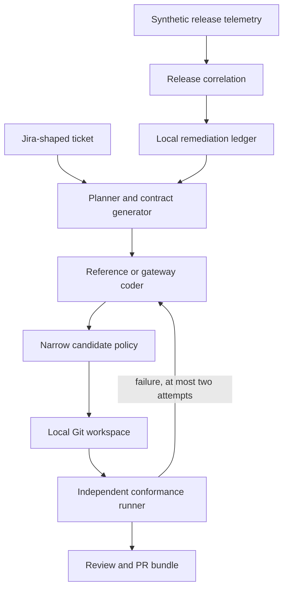

# Implemented vertical-slice architecture

The default engine is standard-library Python. Separate optional modules provide LangGraph feature-step execution, compatible model gateway calls, and Jira/GitHub REST adapters. Integration adapters are not exercised remotely by the default run.

Every candidate is verified in a new subprocess against evaluator-owned public tests. The engine binds verification to a source digest and records Git SHAs. Changes after verification prevent a PR bundle from being accepted. A separate manifest covers the exported artifacts.

The C development run is a linked logical subrun in the same Python harness, not a separately scheduled distributed worker. SQLite provides audit events and operation-key issue deduplication. There is no general crash-resume mechanism, exactly-once external side-effect guarantee, or global transaction.

The generated API uses a single-process loopback HTTP wrapper and SQLite fixture. Optional live code execution must happen in a user-provided disposable sandbox. Hostile-worker isolation and production auth are out of scope for this build.

